# DevSync — Backend Architecture & API Reference

> **Runtime:** Node.js (ES Modules)  
> **Framework:** Express 5  
> **Language:** TypeScript  
> **ORM:** Drizzle ORM v0.44  
> **Database:** PostgreSQL (Supabase)  
> **Real-time:** Socket.io v4  

---

## Folder Structure

```
backend/src/
├── config/
│   ├── db.ts              # Drizzle client + Postgres connection pool
│   └── env.ts             # Zod-validated environment variables
├── db/
│   ├── schema/            # All Drizzle table definitions (10 files)
│   └── migrations/        # SQL migration files (generated by drizzle-kit)
├── lib/
│   └── encryption.ts      # AES-256-GCM encrypt/decrypt for secrets (GitHub tokens)
├── middleware/
│   ├── auth.ts            # JWT verification → populates req.user
│   ├── roles.ts           # RBAC guards (requireWorkspaceRole, requireProjectRole)
│   └── slugs.ts           # URL param resolvers (slug→workspaceId, key→projectId, taskKey→taskId)
├── modules/               # Feature modules (routes + controllers)
│   ├── auth/
│   ├── workspaces/
│   ├── projects/
│   ├── tasks/
│   ├── sprints/
│   ├── channels/
│   ├── messages/
│   ├── files/
│   ├── github/
│   ├── notifications/
│   ├── search/
│   ├── audit/
│   ├── ai/                # 🔮 Future: AI-powered features
│   └── storage/           # Supabase Storage helper routes
├── sockets/
│   └── index.ts           # Socket.io server init + JWT auth middleware
├── workers/               # 🔮 Future: BullMQ background job processors
└── index.ts               # Express app entry point + route mounting
```

---

## Request Lifecycle

Every API request flows through this pipeline:

```mermaid
flowchart LR
    A["Client Request"] --> B["Express Middleware"]
    B --> C["helmet + cors + morgan"]
    C --> D["express.json + cookieParser"]
    D --> E["Route Matching"]
    E --> F["requireAuth"]
    F --> G["Param Resolvers\n(slug→ID, key→ID)"]
    G --> H["requireWorkspaceRole"]
    H --> I["requireProjectRole\n(if project route)"]
    I --> J["Controller"]
    J --> K["Drizzle ORM → PostgreSQL"]
    K --> L["JSON Response"]
```



---

## Authentication Flow

### Email/Password
1. **Register** → `POST /api/auth/register` → bcrypt hash password → insert user → issue JWT + refresh token
2. **Login** → `POST /api/auth/login` → verify bcrypt → issue JWT (15min) + refresh token (7d, HTTP-only cookie)
3. **Refresh** → `POST /api/auth/refresh` → validate refresh token hash → issue new JWT
4. **Logout** → `POST /api/auth/logout` → revoke refresh token in DB

### OAuth (GitHub / Google)
1. Frontend uses Supabase JS client to initiate OAuth flow
2. Supabase handles the redirect to provider and callback
3. Frontend receives the Supabase session and sends it to `POST /api/auth/oauth/callback`
4. Backend verifies the Supabase token, creates/upserts the user in the local `users` table, and issues its own JWT + refresh token

### JWT Structure
```json
{
  "userId": "uuid",
  "email": "user@example.com",
  "iat": 1234567890,
  "exp": 1234568790
}
```

---

## RBAC (Role-Based Access Control)

### Two-Layer Authorization

**Layer 1: Workspace Role** — checked on every authenticated route under `/:slug/`

| Role | Invite Members | Create Projects | Create Channels | Delete Workspace |
|---|---|---|---|---|
| `owner` | ✅ | ✅ | ✅ | ✅ |
| `admin` | ✅ | ✅ | ✅ | ❌ |
| `member` | ❌ | ❌ | ❌ | ❌ |

**Layer 2: Project Role** — checked on routes under `/:slug/projects/:key/`

| Role | Manage Settings | Start/Close Sprints | Create/Edit Tasks | Read Tasks |
|---|---|---|---|---|
| `project_admin` | ✅ | ✅ | ✅ | ✅ |
| `developer` | ❌ | ❌ | ✅ | ✅ |
| `viewer` | ❌ | ❌ | ❌ | ✅ |

**Implicit Elevation:** Workspace `owner` and `admin` are automatically granted `project_admin` on all projects (see `roles.ts` line 138).

### Middleware Chain Example
```
POST /api/workspaces/:slug/projects/:key/tasks
  → requireAuth          (verify JWT, populate req.user)
  → requireWorkspaceRole(['owner', 'admin', 'member'])
  → requireProjectRole(['project_admin', 'developer'])
  → createTask controller
```

---

## Complete API Endpoint Reference

### Auth Routes — `/api/auth`
| Method | Path | Auth | Role | Description |
|---|---|---|---|---|
| POST | `/register` | ❌ | — | Create account with email/password |
| POST | `/login` | ❌ | — | Login, receive JWT + refresh token |
| POST | `/refresh` | ❌ | — | Exchange refresh token for new JWT |
| POST | `/logout` | ❌ | — | Revoke refresh token |
| POST | `/oauth/callback` | ❌ | — | Exchange Supabase OAuth session for app JWT |
| GET | `/me` | ✅ | — | Get current logged-in user profile |

---

### Workspace Routes — `/api/workspaces`
| Method | Path | Auth | Role | Description |
|---|---|---|---|---|
| POST | `/` | ✅ | — | Create workspace (creator becomes owner) |
| GET | `/` | ✅ | — | List all workspaces user belongs to |
| GET | `/:slug` | ✅ | W: any | Get workspace details + members |
| PATCH | `/:slug` | ✅ | W: owner/admin | Update workspace name, description, icon |
| DELETE | `/:slug` | ✅ | W: owner | Delete workspace permanently |

### Workspace Members — `/api/workspaces/:slug`
| Method | Path | Auth | Role | Description |
|---|---|---|---|---|
| GET | `/members` | ✅ | W: any | List all workspace members with roles |
| POST | `/invite` | ✅ | W: owner/admin | Invite a user by email |
| POST | `/invites/accept` | ✅ | — | Accept workspace invite |
| PATCH | `/members/:userId` | ✅ | W: owner | Change a member's workspace role |
| DELETE | `/members/:userId` | ✅ | W: owner/admin | Remove a member from workspace |

---

### Project Routes — `/api/workspaces/:slug/projects`
| Method | Path | Auth | Role | Description |
|---|---|---|---|---|
| POST | `/` | ✅ | W: owner/admin | Create project |
| GET | `/` | ✅ | W: any | List all projects in workspace |
| GET | `/:key` | ✅ | P: any | Get project details |
| PATCH | `/:key` | ✅ | P: admin/dev | Update project name, description, lead |
| PATCH | `/:key/archive` | ✅ | P: admin | Archive/unarchive project |

### Project Members — `/api/workspaces/:slug/projects/:key`
| Method | Path | Auth | Role | Description |
|---|---|---|---|---|
| GET | `/members` | ✅ | P: any | List project members |
| POST | `/members` | ✅ | P: admin | Add member to project with role |
| PUT | `/members/:userId` | ✅ | P: admin | Change member's project role |
| DELETE | `/members/:userId` | ✅ | P: admin | Remove member from project |

---

### Task Routes — `/api/workspaces/:slug/projects/:key/tasks`
| Method | Path | Auth | Role | Description |
|---|---|---|---|---|
| POST | `/` | ✅ | P: admin/dev | Create task (auto-generates task key) |
| GET | `/` | ✅ | P: any | List tasks (filterable by status, assignee, sprint, priority) |
| GET | `/:taskKey` | ✅ | P: any | Get single task by key (e.g., FE-3) |
| PATCH | `/:taskKey` | ✅ | P: admin/dev | Update task fields |
| PATCH | `/:taskKey/reorder` | ✅ | P: admin/dev | Update LexoRank for drag-drop |
| DELETE | `/:taskKey` | ✅ | P: admin | Soft-delete task |

### Task Comments — `/api/workspaces/:slug/projects/:key/tasks/:taskKey`
| Method | Path | Auth | Role | Description |
|---|---|---|---|---|
| GET | `/comments` | ✅ | P: any | List task discussion comments |
| POST | `/comments` | ✅ | P: admin/dev | Post a comment on a task |

---

### Sprint Routes — `/api/workspaces/:slug/projects/:key/sprints`
| Method | Path | Auth | Role | Description |
|---|---|---|---|---|
| POST | `/` | ✅ | P: admin | Create sprint |
| GET | `/` | ✅ | P: any | List all sprints for project |
| PATCH | `/:sprintId` | ✅ | P: admin | Update sprint name, goal, dates |
| PATCH | `/:sprintId/start` | ✅ | P: admin | Start a future sprint |
| PATCH | `/:sprintId/close` | ✅ | P: admin | Close active sprint |
| DELETE | `/:sprintId` | ✅ | P: admin | Delete sprint |

### Sprint-Task Management
| Method | Path | Auth | Role | Description |
|---|---|---|---|---|
| POST | `/:sprintId/tasks` | ✅ | P: admin/dev | Add task to sprint |
| DELETE | `/:sprintId/tasks/:taskId` | ✅ | P: admin/dev | Remove task from sprint |

---

### Channel Routes — `/api/workspaces/:slug/channels`
| Method | Path | Auth | Role | Description |
|---|---|---|---|---|
| POST | `/` | ✅ | W: owner/admin | Create channel |
| GET | `/` | ✅ | W: any | List workspace channels |
| GET | `/:channelId` | ✅ | W: any | Get channel details |
| POST | `/:channelId/join` | ✅ | W: any | Join a channel |
| DELETE | `/:channelId/leave` | ✅ | W: any | Leave a channel |
| PATCH | `/:channelId` | ✅ | W: owner/admin | Update channel settings |
| PATCH | `/:channelId/archive` | ✅ | W: owner/admin | Archive channel |
| DELETE | `/:channelId` | ✅ | W: owner/admin | Delete channel |

---

### Message Routes — `/api/workspaces/:slug/channels/:channelId/messages`
| Method | Path | Auth | Role | Description |
|---|---|---|---|---|
| POST | `/` | ✅ | — | Send a message |
| GET | `/` | ✅ | — | List messages (paginated) |
| GET | `/:messageId/thread` | ✅ | — | Get thread replies |
| PATCH | `/:messageId` | ✅ | — | Edit own message |
| DELETE | `/:messageId` | ✅ | — | Delete own message |

---

### GitHub Routes — `/api/workspaces/:slug/projects/:key/github`
| Method | Path | Auth | Role | Description |
|---|---|---|---|---|
| GET | `/connection` | ✅ | P: any | Get current GitHub connection |
| POST | `/connect` | ✅ | P: admin | Connect a GitHub repo |
| DELETE | `/disconnect` | ✅ | P: admin | Disconnect GitHub repo |
| GET | `/commits` | ✅ | P: any | List commits from webhook data |
| GET | `/ci` | ✅ | P: any | List CI/CD run statuses |

### GitHub Task-Level — `/api/workspaces/:slug/projects/:key/tasks/:taskKey/github`
| Method | Path | Auth | Role | Description |
|---|---|---|---|---|
| GET | `/commits` | ✅ | P: any | Get commits linked to this task |

### GitHub Webhook — `/api/webhooks/github`
| Method | Path | Auth | Role | Description |
|---|---|---|---|---|
| POST | `/:projectId` | ❌ | HMAC | Receive push and workflow events from GitHub |

---

### File Routes — `/api/workspaces/:slug/files`
| Method | Path | Auth | Role | Description |
|---|---|---|---|---|
| POST | `/upload-url` | ✅ | W: any | Get presigned upload URL for Supabase Storage |
| GET | `/:fileId/download` | ✅ | W: any | Get presigned download URL |

---

### Notification Routes — `/api/notifications`
| Method | Path | Auth | Role | Description |
|---|---|---|---|---|
| GET | `/` | ✅ | — | List notifications for current user |
| PATCH | `/read-all` | ✅ | — | Mark all notifications as read |
| PATCH | `/:notificationId/read` | ✅ | — | Mark single notification as read |

---

### Search Routes — `/api/workspaces/:slug/search`
| Method | Path | Auth | Role | Description |
|---|---|---|---|---|
| GET | `/?q=...&type=task\|message` | ✅ | — | Full-text search across tasks and messages |

---

### Audit Routes — `/api/audit`
| Method | Path | Auth | Role | Description |
|---|---|---|---|---|
| GET | `/:entityType/:entityId` | ✅ | — | Get audit log entries for an entity |

---

## Real-Time (Socket.io)

### Connection
- Server initializes Socket.io on the same HTTP server as Express
- Client sends JWT token in `socket.handshake.auth.token`
- Server middleware verifies JWT and attaches `socket.data.userId`

### Rooms
| Room Pattern | Purpose |
|---|---|
| `user:{userId}` | Personal room (auto-joined on connect) for direct notifications |
| `channel:{channelId}` | Message room — joined/left via `join_room` / `leave_room` events |

### Events
| Event | Direction | Payload | Description |
|---|---|---|---|
| `join_room` | Client → Server | `roomId: string` | Join a channel room |
| `leave_room` | Client → Server | `roomId: string` | Leave a channel room |
| `new_message` | Server → Client | `Message` object | New message broadcast to channel members |

---

## 🔮 Future Scope

### AI Module (`modules/ai/`)
The `ai/` module directory exists but is **not yet mounted** in the Express app. Planned features include:
- AI-powered sprint summaries on sprint close
- AI contribution reports per team member
- AI task duration estimation
- Smart task suggestions based on project context

The database schema already has fields reserved for AI output:
- `sprints.ai_summary` (jsonb)
- `sprints.ai_contribution_report` (jsonb)
- `tasks.ai_duration_estimate` (numeric)

### Background Workers (`workers/`)
The `workers/` directory is **empty**. BullMQ and ioredis are installed in `package.json` but not wired up. Planned use cases:
- Email notification delivery
- Heavy webhook payload processing
- Scheduled sprint reminders
- AI processing jobs (long-running LLM calls)

### Storage Module (`modules/storage/`)
Mounted at `/api/storage` but overlaps with the `files` module. May be consolidated in a future refactor.
