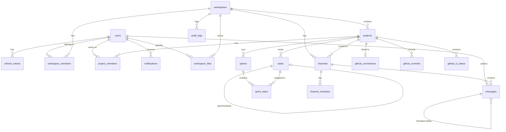

# DevSync — Database Schema Reference

> **ORM:** Drizzle ORM v0.44  
> **Database:** PostgreSQL (hosted on Supabase)  
> **Schema Files:** `backend/src/db/schema/`

---

## Entity Relationship Diagram

---

## Table: `users`
**File:** `schema/auth.ts`  
**Purpose:** All registered users. Supports email/password, GitHub OAuth, and Google OAuth.

| Column | Type | Constraints | Description |
|---|---|---|---|
| `user_id` | `uuid` | PK, default random | Unique identifier |
| `email` | `varchar(255)` | UNIQUE, NOT NULL | Login email |
| `full_name` | `varchar(255)` | NOT NULL | Display name |
| `display_name` | `varchar(80)` | nullable | Short name override |
| `avatar_url` | `text` | nullable | Profile picture URL |
| `github_id` | `varchar(64)` | UNIQUE | GitHub OAuth ID |
| `github_login` | `varchar(64)` | nullable | GitHub username |
| `google_id` | `varchar(64)` | UNIQUE | Google OAuth ID |
| `password_hash` | `text` | nullable | bcrypt hash (null for OAuth-only users) |
| `presence` | `varchar(20)` | default `'offline'` | online / offline / away |
| `last_active_at` | `timestamptz` | nullable | Last activity timestamp |
| `created_at` | `timestamptz` | default now | Registration date |
| `updated_at` | `timestamptz` | default now | Last profile update |
| `deleted_at` | `timestamptz` | nullable | Soft delete (null = active) |

---

## Table: `refresh_tokens`
**File:** `schema/auth.ts`  
**Purpose:** JWT refresh token storage for session management.

| Column | Type | Constraints | Description |
|---|---|---|---|
| `token_id` | `uuid` | PK, default random | Unique identifier |
| `user_id` | `uuid` | FK → `users.user_id` ON DELETE CASCADE | Token owner |
| `token_hash` | `varchar(64)` | UNIQUE, NOT NULL | SHA-256 hash of the refresh token |
| `device_info` | `jsonb` | nullable | Browser/device metadata |
| `issued_at` | `timestamptz` | default now | Token issue time |
| `expires_at` | `timestamptz` | NOT NULL | Expiration time |
| `revoked_at` | `timestamptz` | nullable | Set when token is revoked (logout) |

---

## Table: `workspaces`
**File:** `schema/workspaces.ts`  
**Purpose:** Top-level organizational unit. All projects, channels, and members live under a workspace.

| Column | Type | Constraints | Description |
|---|---|---|---|
| `workspace_id` | `uuid` | PK, default random | Unique identifier |
| `name` | `varchar(100)` | NOT NULL | Workspace name |
| `slug` | `varchar(50)` | UNIQUE, NOT NULL | URL-safe identifier (e.g., `devsync`) |
| `icon_url` | `text` | nullable | Workspace avatar/icon |
| `description` | `text` | nullable | Short description |
| `owner_id` | `uuid` | FK → `users.user_id` ON DELETE SET NULL | Workspace creator |
| `created_at` | `timestamptz` | default now | Creation date |
| `updated_at` | `timestamptz` | default now | Last update |
| `deleted_at` | `timestamptz` | nullable | Soft delete |

---

## Table: `workspace_members`
**File:** `schema/workspaces.ts`  
**Purpose:** Maps users to workspaces with roles and membership state.

| Column | Type | Constraints | Description |
|---|---|---|---|
| `id` | `uuid` | PK, default random | Row identifier |
| `workspace_id` | `uuid` | FK → `workspaces` ON DELETE CASCADE | Parent workspace |
| `user_id` | `uuid` | FK → `users` ON DELETE CASCADE | Member user |
| `role` | `varchar(20)` | NOT NULL | `owner` \| `admin` \| `member` |
| `invited_by` | `uuid` | FK → `users` ON DELETE SET NULL | Who sent the invite |
| `joined_at` | `timestamptz` | default now | Date joined or invited |
| `state` | `varchar(20)` | default `'active'` | `active` \| `invited` \| `deactivated` |

**Unique Constraint:** `(workspace_id, user_id)` — one membership per user per workspace.

---

## Table: `projects`
**File:** `schema/projects.ts`  
**Purpose:** A project within a workspace. Contains tasks, sprints, and optionally a GitHub repo connection.

| Column | Type | Constraints | Description |
|---|---|---|---|
| `project_id` | `uuid` | PK, default random | Unique identifier |
| `workspace_id` | `uuid` | FK → `workspaces` ON DELETE CASCADE | Parent workspace |
| `name` | `varchar(100)` | NOT NULL | Project name |
| `key` | `varchar(10)` | NOT NULL | Immutable prefix for task keys (e.g., `FE`) |
| `description` | `text` | nullable | Project description |
| `icon_url` | `text` | nullable | Project icon |
| `lead_user_id` | `uuid` | FK → `users` ON DELETE SET NULL | Project lead |
| `github_repo_owner` | `varchar(100)` | nullable | GitHub org/user (legacy, see `github_connections`) |
| `github_repo_name` | `varchar(200)` | nullable | GitHub repo name (legacy) |
| `github_webhook_secret` | `varchar(128)` | nullable | Encrypted HMAC secret (legacy) |
| `issue_counter` | `integer` | default `0` | Auto-incrementing task number (FE-1, FE-2, …) |
| `status` | `varchar(20)` | default `'active'` | `active` \| `archived` |
| `created_at` | `timestamptz` | default now | Creation date |
| `updated_at` | `timestamptz` | default now | Last update |

**Unique Constraint:** `(workspace_id, key)` — key is unique per workspace.

---

## Table: `project_members`
**File:** `schema/projects.ts`  
**Purpose:** Maps users to projects with project-specific roles.

| Column | Type | Constraints | Description |
|---|---|---|---|
| `id` | `uuid` | PK, default random | Row identifier |
| `project_id` | `uuid` | FK → `projects` ON DELETE CASCADE | Parent project |
| `user_id` | `uuid` | FK → `users` ON DELETE CASCADE | Member user |
| `role` | `varchar(30)` | NOT NULL | `project_admin` \| `developer` \| `viewer` |
| `added_by` | `uuid` | FK → `users` ON DELETE SET NULL | Who added this member |
| `added_at` | `timestamptz` | default now | Date added |

**Unique Constraint:** `(project_id, user_id)` — one role per user per project.

---

## Table: `tasks`
**File:** `schema/tasks.ts`  
**Purpose:** Core issue tracking entity. Supports epics, stories, tasks, bugs, and subtasks.

| Column | Type | Constraints | Description |
|---|---|---|---|
| `task_id` | `uuid` | PK, default random | Unique identifier |
| `task_key` | `varchar(20)` | NOT NULL | Human-readable key (e.g., `FE-3`) |
| `project_id` | `uuid` | FK → `projects` ON DELETE CASCADE | Parent project |
| `parent_task_id` | `uuid` | self-referencing FK | Parent task (for subtasks) |
| `epic_id` | `uuid` | self-referencing FK | Epic this task belongs to |
| `sprint_id` | `uuid` | FK → `sprints` (added in migration) | Current sprint assignment |
| `title` | `varchar(500)` | NOT NULL | Task title |
| `description` | `jsonb` | default `{}` | Rich text description (structured JSON) |
| `description_text` | `text` | default `''` | Plain text for search indexing |
| `issue_type` | `varchar(20)` | default `'task'` | `epic` \| `story` \| `task` \| `bug` \| `subtask` |
| `status` | `varchar(30)` | default `'todo'` | `todo` \| `in_progress` \| `in_review` \| `done` |
| `priority` | `varchar(20)` | default `'medium'` | `critical` \| `high` \| `medium` \| `low` |
| `reporter_id` | `uuid` | FK → `users` ON DELETE SET NULL | Task creator |
| `assignee_id` | `uuid` | FK → `users` ON DELETE SET NULL | Assigned developer |
| `due_date` | `timestamp` | nullable | Task deadline |
| `labels` | `jsonb` | default `[]` | Flat array: `["frontend", "bug"]` |
| `rank` | `varchar(255)` | nullable | LexoRank string for drag-drop ordering |
| `ai_duration_estimate` | `numeric(6,2)` | nullable | AI-estimated hours |
| `linked_commits_count` | `integer` | default `0` | Count of linked GitHub commits |
| `discussion_thread_id` | `uuid` | FK → `messages` (added in migration) | Task discussion thread |
| `created_at` | `timestamptz` | default now | Creation date |
| `updated_at` | `timestamptz` | default now | Last update |
| `deleted_at` | `timestamptz` | nullable | Soft delete |

**Unique Index:** `(project_id, task_key)` — task keys are unique per project.

> **Note:** `description_tsv` (TSVECTOR) is a generated column added via custom migration SQL for full-text search. Drizzle does not support generated columns natively.

---

## Table: `sprints`
**File:** `schema/sprints.ts`  
**Purpose:** Time-boxed iteration containing a subset of tasks.

| Column | Type | Constraints | Description |
|---|---|---|---|
| `sprint_id` | `uuid` | PK, default random | Unique identifier |
| `project_id` | `uuid` | FK → `projects` ON DELETE CASCADE | Parent project |
| `name` | `varchar(200)` | NOT NULL | Sprint name (e.g., "Sprint 2 — Board") |
| `goal` | `text` | nullable | Sprint goal description |
| `status` | `varchar(20)` | default `'future'` | `future` \| `active` \| `closed` |
| `start_date` | `timestamptz` | nullable | When the sprint was started |
| `end_date` | `timestamptz` | nullable | Planned end date |
| `closed_at` | `timestamptz` | nullable | Actual close timestamp |
| `closed_by` | `uuid` | FK → `users` ON DELETE SET NULL | Who closed the sprint |
| `velocity_issues` | `integer` | nullable | Number of issues completed (set on close) |
| `sequence_number` | `integer` | NOT NULL | Sprint order within project |
| `ai_summary` | `jsonb` | nullable | AI-generated sprint summary |
| `ai_contribution_report` | `jsonb` | nullable | AI-generated per-member contribution |
| `summary_message_id` | `uuid` | FK → `messages` (added in migration) | Summary posted to channel |
| `created_at` | `timestamptz` | default now | Creation date |
| `updated_at` | `timestamptz` | default now | Last update |

**Unique Constraint:** `(project_id, sequence_number)` — sprint numbers are unique per project.

---

## Table: `sprint_tasks`
**File:** `schema/sprints.ts`  
**Purpose:** Many-to-many join table linking tasks to sprints.

| Column | Type | Constraints | Description |
|---|---|---|---|
| `id` | `uuid` | PK, default random | Row identifier |
| `sprint_id` | `uuid` | FK → `sprints` ON DELETE CASCADE | Sprint |
| `task_id` | `uuid` | FK → `tasks` ON DELETE CASCADE | Task |
| `was_completed_in_sprint` | `boolean` | nullable | Whether the task was done before sprint closed |

**Unique Constraint:** `(sprint_id, task_id)` — a task can only be in a sprint once.

---

## Table: `channels`
**File:** `schema/channels.ts`  
**Purpose:** Communication channels (workspace-level or project-scoped). Supports public, private, DM, and group DM types.

| Column | Type | Constraints | Description |
|---|---|---|---|
| `channel_id` | `uuid` | PK, default random | Unique identifier |
| `workspace_id` | `uuid` | FK → `workspaces` ON DELETE CASCADE | Parent workspace |
| `project_id` | `uuid` | FK → `projects` ON DELETE CASCADE, nullable | If set, channel is project-scoped |
| `name` | `varchar(80)` | nullable | Channel name (null for DMs) |
| `slug` | `varchar(80)` | nullable | URL-safe channel name |
| `description` | `text` | nullable | Channel description |
| `type` | `varchar(20)` | NOT NULL | `public` \| `private` \| `dm` \| `group_dm` |
| `is_default` | `boolean` | default `false` | Auto-join on workspace entry |
| `is_archived` | `boolean` | default `false` | Archived channels are read-only |
| `is_announcement_only` | `boolean` | default `false` | Only admins can post |
| `created_by` | `uuid` | FK → `users` ON DELETE SET NULL | Channel creator |
| `created_at` | `timestamptz` | default now | Creation date |

**Unique Constraint:** `(workspace_id, slug)` — channel slugs are unique per workspace.

---

## Table: `channel_members`
**File:** `schema/channels.ts`  
**Purpose:** Tracks which users have joined which channels.

| Column | Type | Constraints | Description |
|---|---|---|---|
| `id` | `uuid` | PK, default random | Row identifier |
| `channel_id` | `uuid` | FK → `channels` ON DELETE CASCADE | Channel |
| `user_id` | `uuid` | FK → `users` ON DELETE CASCADE | Member |
| `joined_at` | `timestamptz` | default now | When user joined |

**Unique Constraint:** `(channel_id, user_id)`

---

## Table: `messages`
**File:** `schema/channels.ts`  
**Purpose:** All messages across channels. Supports threading, editing, pinning, and system messages.

| Column | Type | Constraints | Description |
|---|---|---|---|
| `message_id` | `uuid` | PK, default random | Unique identifier |
| `channel_id` | `uuid` | FK → `channels` ON DELETE CASCADE | Parent channel |
| `author_id` | `uuid` | FK → `users` ON DELETE SET NULL | Message author |
| `is_system` | `boolean` | default `false` | System-generated message |
| `system_type` | `varchar(30)` | nullable | e.g., `member_joined`, `sprint_started` |
| `body_text` | `text` | NOT NULL, default `''` | Message content (HTML from Tiptap editor) |
| `body_blocks` | `jsonb` | nullable | Structured block content |
| `thread_id` | `uuid` | self-referencing FK | Parent message (for threaded replies) |
| `reply_count` | `integer` | default `0` | Number of thread replies |
| `is_edited` | `boolean` | default `false` | Whether the message has been edited |
| `is_deleted` | `boolean` | default `false` | Soft delete flag |
| `is_pinned` | `boolean` | default `false` | Pinned message indicator |
| `created_at` | `timestamptz` | default now | Sent timestamp |
| `updated_at` | `timestamptz` | default now | Last edit timestamp |

> **Note:** `body_tsv` (TSVECTOR) is a generated column added via migration SQL for full-text search.

---

## Table: `workspace_files`
**File:** `schema/channels.ts`  
**Purpose:** Metadata for files uploaded to Supabase Storage.

| Column | Type | Constraints | Description |
|---|---|---|---|
| `file_id` | `uuid` | PK, default random | Unique identifier |
| `workspace_id` | `uuid` | FK → `workspaces` ON DELETE CASCADE | Parent workspace |
| `uploader_id` | `uuid` | FK → `users` ON DELETE SET NULL | Who uploaded |
| `filename` | `varchar(255)` | NOT NULL | Original filename |
| `storage_path` | `text` | NOT NULL | Supabase Storage bucket path |
| `mimetype` | `varchar(100)` | nullable | MIME type |
| `size_bytes` | `bigint` | nullable | File size in bytes |
| `filetype` | `varchar(20)` | nullable | `image` \| `pdf` \| `code` \| `video` \| `audio` \| `other` |
| `created_at` | `timestamptz` | default now | Upload timestamp |

---

## Table: `github_connections`
**File:** `schema/github.ts`  
**Purpose:** Links a project to a GitHub repository for commit tracking and CI monitoring.

| Column | Type | Constraints | Description |
|---|---|---|---|
| `connection_id` | `uuid` | PK, default random | Unique identifier |
| `project_id` | `uuid` | FK → `projects` ON DELETE CASCADE, UNIQUE | One connection per project |
| `connected_by` | `uuid` | FK → `users` ON DELETE SET NULL | Who connected the repo |
| `github_repo_full_name` | `varchar(300)` | NOT NULL | e.g., `owner/repo-name` |
| `github_repo_id` | `bigint` | nullable | GitHub's numeric repo ID |
| `default_branch` | `varchar(200)` | default `'main'` | Default branch name |
| `github_access_token` | `text` | nullable | Encrypted Personal Access Token |
| `webhook_id` | `bigint` | nullable | GitHub webhook ID |
| `webhook_secret` | `text` | nullable | Encrypted HMAC webhook secret |
| `created_at` | `timestamptz` | default now | Connection date |

---

## Table: `github_commits`
**File:** `schema/github.ts`  
**Purpose:** Stores commits received via GitHub webhooks. Auto-links to tasks if commit message contains a task key.

| Column | Type | Constraints | Description |
|---|---|---|---|
| `id` | `uuid` | PK, default random | Row identifier |
| `project_id` | `uuid` | FK → `projects` ON DELETE CASCADE | Parent project |
| `task_id` | `uuid` | FK → `tasks` ON DELETE SET NULL, nullable | Linked task (auto-detected from commit message) |
| `commit_sha` | `varchar(40)` | NOT NULL | Full 40-char commit SHA |
| `repo_full_name` | `varchar(300)` | NOT NULL | `owner/repo` format |
| `message` | `text` | NOT NULL | Full commit message |
| `message_headline` | `varchar(200)` | NOT NULL | First line of commit message |
| `author_name` | `varchar(200)` | nullable | Git author name |
| `author_github_login` | `varchar(100)` | nullable | GitHub username |
| `author_user_id` | `uuid` | FK → `users` ON DELETE SET NULL, nullable | Mapped DevSync user |
| `committed_at` | `timestamptz` | NOT NULL | Commit timestamp |
| `branch_name` | `varchar(200)` | nullable | Branch the commit was on |
| `url` | `text` | nullable | Link to commit on GitHub |
| `created_at` | `timestamptz` | default now | Record creation date |

**Unique Constraint:** `(repo_full_name, commit_sha)` — no duplicate commits.

---

## Table: `github_ci_status`
**File:** `schema/github.ts`  
**Purpose:** GitHub Actions workflow run statuses, received via webhooks.

| Column | Type | Constraints | Description |
|---|---|---|---|
| `id` | `uuid` | PK, default random | Row identifier |
| `project_id` | `uuid` | FK → `projects` ON DELETE CASCADE | Parent project |
| `workflow_name` | `varchar(200)` | nullable | GitHub Actions workflow name |
| `run_id` | `bigint` | NOT NULL | GitHub Actions run ID |
| `status` | `varchar(30)` | NOT NULL | `queued` \| `in_progress` \| `completed` |
| `conclusion` | `varchar(30)` | nullable | `success` \| `failure` \| `cancelled` \| `skipped` |
| `head_branch` | `varchar(200)` | nullable | Branch that triggered the run |
| `head_sha` | `varchar(40)` | nullable | Commit SHA |
| `html_url` | `text` | nullable | Link to run on GitHub |
| `triggered_at` | `timestamptz` | NOT NULL | When the workflow was triggered |
| `completed_at` | `timestamptz` | nullable | When the workflow finished |
| `created_at` | `timestamptz` | default now | Record creation date |

---

## Table: `notifications`
**File:** `schema/notifications.ts`  
**Purpose:** In-app notifications for task assignments, mentions, sprint events, CI status, etc.

| Column | Type | Constraints | Description |
|---|---|---|---|
| `notification_id` | `uuid` | PK, default random | Unique identifier |
| `recipient_id` | `uuid` | FK → `users` ON DELETE CASCADE | User who receives the notification |
| `actor_id` | `uuid` | FK → `users` ON DELETE SET NULL, nullable | User who triggered the notification |
| `type` | `varchar(50)` | NOT NULL | `task_assigned` \| `task_mentioned` \| `task_commented` \| `sprint_closed` \| `sprint_started` \| `channel_mentioned` \| `dm_received` \| `ci_failed` \| `ci_passed` \| `commit_linked` |
| `entity_type` | `varchar(30)` | NOT NULL | `task` \| `sprint` \| `message` \| `project` |
| `entity_id` | `uuid` | NOT NULL | ID of the related entity |
| `title` | `varchar(255)` | nullable | Notification title |
| `body` | `text` | nullable | Notification body text |
| `is_read` | `boolean` | default `false` | Read status |
| `read_at` | `timestamptz` | nullable | When marked as read |
| `created_at` | `timestamptz` | default now | Notification timestamp |

---

## Table: `audit_logs`
**File:** `schema/audit.ts`  
**Purpose:** Tracks all significant user actions for auditability.

| Column | Type | Constraints | Description |
|---|---|---|---|
| `log_id` | `uuid` | PK, default random | Unique identifier |
| `actor_id` | `uuid` | FK → `users` ON DELETE SET NULL | Who performed the action |
| `action` | `varchar(100)` | NOT NULL | e.g., `task.create`, `sprint.close`, `member.invite` |
| `entity_type` | `varchar(30)` | nullable | `task` \| `sprint` \| `project` \| `workspace` |
| `entity_id` | `uuid` | nullable | ID of the affected entity |
| `workspace_id` | `uuid` | FK → `workspaces` ON DELETE CASCADE | Workspace context |
| `old_values` | `jsonb` | nullable | Previous state (for updates) |
| `new_values` | `jsonb` | nullable | New state (for creates/updates) |
| `created_at` | `timestamptz` | default now | Timestamp of the action |
